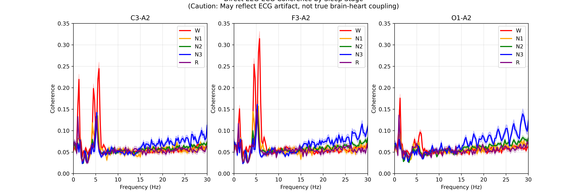
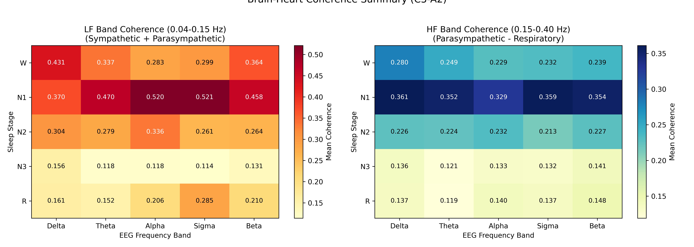

# EEG-ECG Coherence Analysis: Brain-Heart Coupling During Sleep

## Overview

This project investigates the **brain-heart coupling** during different sleep stages by analyzing the coherence between electroencephalogram (EEG) signals and electrocardiogram (ECG) signals. The analysis uses polysomnography (PSG) data from the ISRUC-Sleep dataset to explore how neural oscillations and cardiac autonomic activity are synchronized across the sleep-wake cycle.

The fundamental question of this analysis is: **How does the communication between the brain and the heart change as we transition through different states of consciousness during sleep?**

---

## Table of Contents

1. [Scientific Background](#scientific-background)
2. [Dataset](#dataset)
3. [Analysis Pipeline](#analysis-pipeline)
   - [Step 1: Data Loading and Preparation](#step-1-data-loading-and-preparation)
   - [Step 2: ECG Channel Identification](#step-2-ecg-channel-identification)
   - [Step 3: Signal Preprocessing](#step-3-signal-preprocessing)
   - [Step 4: Epoch Creation and Artifact Rejection](#step-4-epoch-creation-and-artifact-rejection)
   - [Step 5: Direct EEG-ECG Coherence Analysis](#step-5-direct-eeg-ecg-coherence-analysis)
   - [Step 6: HRV-Based Brain-Heart Coherence Analysis](#step-6-hrv-based-brain-heart-coherence-analysis)
4. [Key Results](#key-results)
5. [Interpretation Guide](#interpretation-guide)
6. [Technical Implementation Details](#technical-implementation-details)
7. [Dependencies](#dependencies)
8. [Limitations and Future Work](#limitations-and-future-work)

---

## Scientific Background

### The Brain-Heart Axis

The brain and heart are in constant bidirectional communication through the autonomic nervous system. This "brain-heart axis" operates through:

- **Sympathetic nervous system**: Increases heart rate, associated with activation level and stress
- **Parasympathetic nervous system (vagus nerve)**: Decreases heart rate, associated with rest and recovery

This communication is not static—it dynamically changes based on our state of consciousness, emotional state, and sleep stage.

### Reasons to Study Brain-Heart Coherence During Sleep:

Sleep provides a natural experimental paradigm for studying brain-heart interactions because:

1. **Distinct physiological states**: Sleep stages (Wake, N1, N2, N3, REM) represent defined neurophysiological states
2. **Reduced confounds**: During sleep, behavioral artifacts and cognitive processes are minimized
3. **Clinical relevance**: Disrupted brain-heart coupling may be a biomarker for sleep disorders, cardiovascular risk, and neurological conditions

### Coherence:

Coherence is a frequency-domain measure of the linear correlation between two signals. It ranges from 0 (no linear relationship) to 1 (perfect linear relationship). In this context:

- **High coherence** between EEG and cardiac signals indicates that fluctuations in brain activity are synchronized with fluctuations in heart activity
- The frequency at which coherence is observed tells us about the timescale of this coupling

---

## Dataset

### ISRUC-Sleep Dataset

This analysis uses the [**ISRUC-Sleep**](https://sleeptight.isr.uc.pt/) dataset, a publicly available polysomnographic database. Specifically, I used:

- **Subgroup 1**: Subjects with sleep disorders
- **Subject 1**: Individual recording (<u>1 individual only</u>) used for this analysis

### Data Specifications

| Parameter | Value |
|-----------|-------|
| Sampling Rate | 200 Hz |
| Recording Duration | ~8.03 hours |
| Epoch Length | 30 seconds (standard PSG) |
| Total Epochs | 968 |
| Sleep Staging | Expert-scored (W, N1, N2, N3, R) |

### Channels Used

**EEG Channels:**
- `C3-A2` (Central)
- `F3-A2` (Frontal)
- `O1-A2` (Occipital)

**ECG Channel:**
- `X2` (automatically identified from unlabeled auxiliary channels)

### File Format

The original data is in `.rec` format (EDF variant), which is handled by copying to `.edf` for compatibility with MNE-Python.

---

## Analysis Pipeline

### Step 1: Data Loading and Preparation

#### What I Did

```python
# Load the EDF file
raw = mne.io.read_raw_edf(edf_file_path, preload=True, verbose=False)

# Load the Hypnogram (sleep staging)
hypno_df = pd.read_excel(hypnogram_path)
sleep_stages = hypno_df['Stage'].values

# Standardize Stage Labels
stage_map = {'W': 0, 'N1': 1, 'N2': 2, 'N3': 3, 'R': 4}
```

#### Logic and Rationale

1. **MNE-Python** is the gold standard for neurophysiological signal processing in Python. It handles EDF files natively and provides an ecosystem for subsequent analysis.

2. **Preloading** the data into memory (`preload=True`) is essential for efficient processing in subsequent steps, despite the higher memory footprint.

3. **Stage mapping** converts textual sleep stage labels to integers for efficient indexing. The mapping follows the American Academy of Sleep Medicine (AASM) convention:
   - W = Wake
   - N1 = Stage 1 NREM (light sleep)
   - N2 = Stage 2 NREM (sleep spindles, K-complexes)
   - N3 = Stage 3 NREM (slow-wave sleep, deep sleep)
   - R = REM (rapid eye movement, dreaming)

---

### Step 2: ECG Channel Identification

#### The Challenge

The ISRUC dataset has several auxiliary channels labeled `X1` through `X8` without explicit identification of which is the ECG. I needed an automated method to identify the true ECG channel.

#### What I Did

```python
def identify_ecg_channel(raw, candidate_channels):
    """
    Identify ECG channel by detecting characteristic R-peaks.
    ECG should have clear periodic peaks at 0.5-2 Hz (30-120 BPM).
    """
    for ch in candidate_channels:
        # Get 60 seconds of data
        data = raw.copy().pick([ch]).get_data()[0, :int(60*fs)]
        
        # Bandpass filter for ECG (5-15 Hz to isolate QRS)
        b, a = signal.butter(2, [5, 15], btype='band', fs=fs)
        filtered = signal.filtfilt(b, a, data)
        
        # Find peaks (potential R-peaks)
        peaks, _ = find_peaks(filtered, distance=int(0.5*fs), 
                              prominence=np.std(filtered)*0.5)
        
        # Calculate heart rate metrics
        rr_intervals = np.diff(peaks) / fs
        hr = 60 / np.mean(rr_intervals)
        rr_regularity = np.std(rr_intervals) / np.mean(rr_intervals)
        
        # ECG criteria: HR 40-120 BPM, relatively regular rhythm
        is_ecg = (40 < hr < 120) and (rr_regularity < 0.3)
```

#### Logic and Rationale

1. **QRS Complex Isolation**: The 5-15 Hz bandpass filter isolates the QRS complex of the ECG, which contains the majority of the signal energy in this frequency range. This is crucial because:
   - It suppresses low-frequency baseline wander
   - It attenuates high-frequency noise
   - It emphasizes the sharp R-peak

2. **Peak Detection Criteria**:
   - `distance=int(0.5*fs)`: Enforces a minimum of 0.5 seconds between peaks (maximum 120 BPM), preventing false positives
   - `prominence=np.std(filtered)*0.5`: Requires peaks to stand out from local baseline

3. **ECG Validation Metrics**:
   - **Heart Rate (HR)**: 40-120 BPM is physiologically plausible for sleep
   - **Coefficient of Variation (CV) of RR intervals**: < 0.3 indicates regular rhythm (ECG characteristic)

4. **Results**: Channel `X2` was identified as the ECG with HR=63.1 BPM and RR_CV=0.056, indicating a clean, regular cardiac signal.

---

### Step 3: Signal Preprocessing

#### What I Did

```python
# Filter EEG channels: 0.5-30 Hz
raw_filtered.filter(l_freq=0.5, h_freq=30.0, picks=eeg_channels, 
                    fir_design='firwin', verbose=False)

# Filter ECG channel: 0.5-45 Hz (preserve QRS complex)
raw_filtered.filter(l_freq=0.5, h_freq=45.0, picks=[ecg_channel], 
                    fir_design='firwin', verbose=False)
```

#### Logic and Rationale

1. **Separate Filtering for EEG and ECG**: These signals have fundamentally different frequency content:
   
   | Signal | Primary Content | Filter Range |
   |--------|-----------------|--------------|
   | EEG | Neural oscillations | 0.5-30 Hz |
   | ECG | QRS complex, P/T waves | 0.5-45 Hz |

2. **EEG Bandpass (0.5-30 Hz)**:
   - **0.5 Hz high-pass**: Removes slow drift and DC offset
   - **30 Hz low-pass**: Removes muscle artifacts (EMG) while preserving all standard EEG bands:
     - Delta (0.5-4 Hz)
     - Theta (4-8 Hz)
     - Alpha (8-12 Hz)
     - Sigma (12-16 Hz) - Sleep spindles
     - Beta (16-30 Hz)

3. **ECG Bandpass (0.5-45 Hz)**:
   - **45 Hz low-pass**: Higher than EEG to preserve the sharp morphology of the QRS complex, which is essential for accurate R-peak detection
   - The QRS complex contains significant energy up to ~40 Hz

4. **FIR Filter Design**: `firwin` provides linear phase response, which preserves waveform morphology, which is critical for both EEG analysis and ECG peak detection.

#### ICA Artifact Removal (Conditional)

```python
if len(eeg_channels) >= 8:
    ica = mne.preprocessing.ICA(n_components=min(15, len(eeg_channels)-1))
    ica.fit(raw_for_ica)
    ecg_indices, ecg_scores = ica.find_bads_ecg(raw_filtered, ch_name=ecg_channel)
    ica.exclude = ecg_indices
    raw_filtered = ica.apply(raw_filtered, exclude=ecg_indices)
```

**Note**: ICA was skipped in this analysis due to insufficient EEG channels (only 3). ICA requires at least 8-10 channels to effectively decompose the signal into independent components. With more channels, ICA would remove cardiac artifacts from EEG, improving the specificity of the coherence analysis.

#### ECG Artifact Removal via Regression

```python
def remove_ecg_from_eeg_adaptive(raw, eeg_channels, ecg_channel, epoch_duration=30.0):
    """Remove ECG artifact from EEG using adaptive epoch-wise regression."""
    # Create delayed versions of ECG (-20 to +80 samples, i.e., -100ms to +400ms at 200 Hz)
    delays = np.arange(-20, 80)
    
    for eeg_ch in eeg_channels:
        for ep in range(n_epochs):
            # Create delayed ECG matrix (using edge padding, not circular roll)
            X = np.column_stack([delayed_ecg_versions])
            
            # Fit regression: EEG = ECG_component + residual
            coeffs, _, _, _ = np.linalg.lstsq(X, eeg_epoch, rcond=None)
            
            # Subtract ECG component
            ecg_component = X @ coeffs - coeffs[-1]  # Don't subtract the offset
            eeg_clean = eeg_epoch - ecg_component
```

**Logic**: This regression-based approach removes ECG artifacts from EEG by fitting a linear model of delayed ECG versions to each EEG epoch, then subtracting the predicted cardiac component. The wide delay range (-100ms to +400ms) captures the full extent of the cardiac artifact in EEG.

---

### Step 4: Epoch Creation and Artifact Rejection

#### What I Did

```python
# Create 30-second epochs
events = mne.make_fixed_length_events(raw_filtered, duration=30.0)
epochs = mne.Epochs(raw_filtered, events, tmin=0.0, tmax=30.0 - 1/fs, baseline=None, 
                    picks=eeg_channels + [ecg_channel], preload=True)

# Artifact rejection thresholds
reject_criteria = dict(
    eeg=200e-6,   # 200 µV for EEG
    ecg=1e-3      # 1 mV for ECG
)
epochs.drop_bad(reject=reject_criteria)
```

#### Logic and Rationale

1. **30-Second Epochs**: This is the standard PSG epoch length defined by AASM scoring rules. Each epoch corresponds to one sleep stage annotation.

2. **Amplitude-Based Artifact Rejection**:
   
   | Channel Type | Threshold | Rationale |
   |--------------|-----------|-----------|
   | EEG | 200 µV | Normal EEG rarely exceeds 100 µV; 200 µV catches movement/muscle artifacts |
   | ECG | 1 mV | Normal QRS amplitude ~1 mV; threshold catches saturated/noisy segments |

---

### Step 5: Direct EEG-ECG Coherence Analysis

This is the first of two coherence approaches. It computes coherence between raw EEG and raw ECG signals.

#### What I Did

```python
# Coherence parameters
nperseg = fs_int * 4  # 4-second window
noverlap = nperseg // 2  # 50% overlap

for stage_name, stage_code in stage_map.items():
    stage_epochs = epochs[f'stage == {stage_code}']
    
    for eeg_chan in eeg_channels:
        for i in range(len(data)):
            # Detrend signals before coherence
            sig_eeg = detrend(data[i, eeg_idx, :], type='linear')
            sig_ecg = detrend(data[i, ecg_idx, :], type='linear')
            
            f, Cxy = coherence(sig_eeg, sig_ecg, fs=fs_int, window='hamming', 
                               nperseg=nperseg, noverlap=noverlap)
            coh_list.append(Cxy)
```

#### Statistical Averaging with Fisher Z-Transform

```python
# Fisher z-transform for proper averaging of coherence values
coh_clipped = np.clip(coh_array, 1e-10, 1 - 1e-10)
z_coh = np.arctanh(np.sqrt(coh_clipped))

avg_z = np.mean(z_coh, axis=0)
std_z = np.std(z_coh, axis=0)

# Transform back
avg_coh = np.tanh(avg_z)**2

# Propagate uncertainty (first-order approximation)
derivative = 2 * np.tanh(avg_z) * (1 - np.tanh(avg_z)**2)
std_coh = np.abs(derivative) * std_z / np.sqrt(len(coh_array))
```

#### Logic and Rationale

1. **4-Second Windows**: This provides a frequency resolution of 0.25 Hz (fs/nperseg = 200/800), which is sufficient to resolve the main EEG bands.

2. **Hamming Window**: Reduces spectral leakage compared to rectangular windows, providing cleaner coherence estimates.

3. **50% Overlap**: Standard practice that provides a good balance between frequency resolution and temporal smoothness.

4. **Detrending**: Linear detrending removes slow drifts that could artificially inflate low-frequency coherence.

5. **Fisher Z-Transform**: Coherence values are bounded [0, 1] and not normally distributed. The Fisher z-transform:
   - `z = arctanh(√C)` converts coherence to an unbounded, approximately normal distribution
   - This allows proper averaging and standard deviation calculation
   - The inverse transform recovers the average coherence
   - Uncertainty propagation uses the chain rule to convert standard deviation back to coherence space

**Limitations of Direct Coherence**: This approach compares EEG (a measure of neural oscillations) directly with ECG (periodic cardiac contractions). The physiological relationship between these signals operates on different timescales, which motivates the HRV-based approach.

---

### Step 6: HRV-Based Brain-Heart Coherence Analysis

This is the more complex approach that captures true autonomic-neural coupling.

#### Conceptual Framework

Instead of comparing EEG directly to ECG, I compare:
- **EEG band power envelope**: Slow fluctuations (< 0.5 Hz) in the amplitude of EEG oscillations
- **Heart Rate Variability (HRV)**: The variation in time between heartbeats, which reflects autonomic nervous system activity

This captures physiologically meaningful coupling at very low frequencies (0.04-0.4 Hz).

#### Step 6a: R-Peak Detection and HRV Extraction

```python
def detect_r_peaks(ecg_signal, fs):
    """Detect R-peaks using NeuroKit2's optimized pipeline."""
    signals, info = nk.ecg_process(ecg_signal, sampling_rate=fs)
    peaks = info["ECG_R_Peaks"]
    return peaks

def extract_hrv_timeseries(ecg_signal, fs, target_fs=4.0):
    """Extract HRV time series with ectopic beat correction."""
    r_peaks = detect_r_peaks(ecg_signal, fs)
    
    # Calculate RR intervals
    rr_intervals = np.diff(r_peaks) / fs
    rr_times = r_peaks[1:] / fs
    
    # Ectopic beat correction using local median adaptive thresholding
    window_size = 10  # beats
    local_median = pd.Series(rr_intervals).rolling(window_size, center=True, min_periods=3).median()
    local_median = np.where(np.isnan(local_median), median_rr, local_median)  # Handle edges
    
    # Define invalid intervals (ectopic beats)
    invalid_mask = (
        (rr_intervals < 0.3) |  # > 200 BPM
        (rr_intervals > 2.0) |  # < 30 BPM
        (np.abs(rr_intervals - local_median) > 0.25 * local_median)  # >25% deviation
    )
    
    # Interpolate invalid intervals using valid neighbors
    interp_func = interp1d(valid_times, valid_rr, kind='linear',
                           bounds_error=False, fill_value=(valid_rr[0], valid_rr[-1]))
    rr_intervals = interp_func(rr_times)
    
    # Convert to instantaneous heart rate (BPM)
    inst_hr = 60 / rr_intervals
    
    # Resample to uniform 4 Hz using cubic spline
    f_interp = interp1d(rr_times, inst_hr, kind='cubic',
                        bounds_error=False, fill_value=(inst_hr[0], inst_hr[-1]))
    hrv_signal = f_interp(t_new)
    
    return hrv_signal
```

#### Logic and Rationale

1. **NeuroKit2 for R-Peak Detection**: This library implements state-of-the-art ECG processing algorithms that handle noise better than simple peak detection. It uses an optimized processing pipeline that is more robust than custom Pan-Tompkins implementations.

2. **Ectopic Beat Correction**: Premature or missed beats create artifactual spikes in HRV. The improved approach uses:
   - **Local median adaptive thresholding**: Compares each RR interval to a rolling 10-beat local median (with edge handling)
   - **25% deviation threshold**: Intervals deviating >25% from local median are flagged as ectopic
   - **Interpolation**: Invalid intervals are replaced with interpolated values from valid neighbors, preserving the time axis
   - **Boundary handling**: Edge values are used for extrapolation when needed

3. **Resampling to 4 Hz**: 
   - HRV is an inherently low-frequency signal (Nyquist limit based on heart rate ~1-2 Hz)
   - 4 Hz sampling rate provides comfortable headroom while reducing computational load
   - Cubic spline interpolation preserves the smooth nature of HRV fluctuations

#### Step 6b: EEG Band Envelope Extraction

```python
def extract_eeg_band_envelope(eeg_signal, fs, band, target_fs=4.0):
    """Extract amplitude envelope of EEG in a specific frequency band."""
    low, high = band
    
    # Adaptive filter length to minimize edge effects
    filter_length = min(int(fs * 2) + 1, int(3 * fs / low))
    if filter_length % 2 == 0:
        filter_length += 1  # Ensure odd length
    
    # Bandpass filter with padding
    fir_coefs = firwin(numtaps=filter_length, cutoff=[low, high], pass_zero=False, fs=fs)
    padlen = min(3 * len(fir_coefs), len(eeg_signal) - 1)
    filtered = filtfilt(fir_coefs, 1.0, eeg_signal, padlen=padlen)
    
    # Hilbert transform for amplitude envelope
    analytic = hilbert(filtered)
    envelope = np.abs(analytic)
    
    # Anti-aliasing low-pass filter before decimation
    anti_alias_freq = 0.9 * (target_fs / 2)
    b_lp, a_lp = signal.butter(6, anti_alias_freq, btype='low', fs=fs)  # 6th order
    envelope_smooth = signal.filtfilt(b_lp, a_lp, envelope)
    
    # Proper decimation (not resample)
    decimation_factor = int(fs / target_fs)
    envelope_resampled = signal.decimate(envelope_smooth, decimation_factor, ftype='fir', zero_phase=True)
    
    return envelope_resampled
```

#### Logic and Rationale

1. **Adaptive Filter Length**: Filter length is set to 3 cycles of the lowest frequency in the band, capped at 2 seconds, to minimize edge effects in short epochs.

2. **Hilbert Transform**: The analytic signal from the Hilbert transform provides an instantaneous amplitude estimate without rectification artifacts.

3. **Anti-Aliasing and Decimation**: 
   - A 6th-order Butterworth low-pass filter at 90% of Nyquist provides sharp cutoff before decimation
   - `signal.decimate` with FIR filter and zero-phase processing is used instead of `resample` for proper downsampling
   - This prevents aliasing artifacts that could contaminate coherence estimates

4. **EEG Frequency Bands Analyzed**:
   
   | Band | Frequency | Sleep Relevance |
   |------|-----------|-----------------|
   | Delta | 0.5-4 Hz | Dominant in N3 (slow-wave sleep) |
   | Theta | 4-8 Hz | Increases during drowsiness, REM |
   | Alpha | 8-12 Hz | Prominent during relaxed wake |
   | Sigma | 12-16 Hz | Sleep spindles in N2 |
   | Beta | 16-30 Hz | Arousal, wakefulness |

#### Step 6c: Segment Concatenation with Temporal Continuity

```python
def concatenate_stage_epochs(epochs, stage_code, ecg_channel, eeg_channels, 
                             max_duration=300, min_duration=90):
    """Concatenate consecutive epochs of the same sleep stage, ensuring temporal continuity."""
    # Get events to check timing
    events = epochs.events
    expected_gap = int(30.0 * sfreq)  # Expected sample gap for 30s epochs
    
    for i in range(1, len(stage_indices)):
        idx_curr = stage_indices[i]
        idx_prev = stage_indices[i-1]
        
        # Check if adjacent in array AND continuous in time
        is_adjacent = (idx_curr == idx_prev + 1)
        is_continuous_time = (events[idx_curr, 0] - events[idx_prev, 0] == expected_gap)
        
        if is_adjacent and is_continuous_time:
            current_run.append(idx_curr)
        else:
            # End of current run - save if meets minimum duration
            if len(current_run) * 30 >= min_duration:
                segments_list.append(current_run)
            current_run = [idx_curr]
    
    # Split long runs into chunks of max_duration
    for run_indices in segments_list:
        max_epochs = int(max_duration / 30)
        for k in range(0, len(run_indices), max_epochs):
            chunk_indices = run_indices[k : k + max_epochs]
            if len(chunk_indices) * 30 >= min_duration:
                segment_data = np.concatenate([data[i] for i in chunk_indices], axis=1)
                concatenated_segments.append(segment_data)
```

#### Logic and Rationale

1. **Why Concatenate?**: HRV analysis requires longer segments than 30 seconds to resolve the low-frequency components (LF: 0.04-0.15 Hz requires at least 25 seconds for one cycle).

2. **Temporal Continuity Check**: The implementation verifies that epochs are adjacent in the array and their timestamps are continuous (exactly 30 seconds apart). This prevents concatenating epochs that may have been reordered or have missing data.

3. **Minimum 90 Seconds**: To ensure it includes at least 3-4 cycles of LF oscillation for more reliable coherence estimates.

4. **Maximum 300 Seconds**: Caps segments at 5 minutes to:
   - Limit non-stationarity effects
   - Ensure multiple segments per stage for averaging
   - Stay within reasonable memory limits

5. **Chunking Long Runs**: Long continuous runs are split into multiple segments of maximum duration, with short leftover chunks discarded.

#### Step 6d: HRV-EEG Coherence Computation

```python
# Parameters
target_fs = 4.0  # Hz
hrv_nperseg = int(target_fs * 60)  # 60-second window = 240 samples
hrv_noverlap = int(hrv_nperseg * 0.75)  # 75% overlap

# For each segment
hrv_trunc = detrend(hrv_signal[:min_len], type='linear')
eeg_trunc = detrend(eeg_envelope[:min_len], type='linear')

# Compute coherence
f, Cxy = coherence(hrv_trunc, eeg_trunc, fs=target_fs,
                   window='hamming', nperseg=hrv_nperseg,
                   noverlap=hrv_noverlap)

# Fisher Z-transform averaging (same as direct coherence)
z_coh = np.arctanh(np.sqrt(coh_clipped))
avg_z = np.mean(z_coh, axis=0)
avg_coh = np.tanh(avg_z) ** 2
```

#### Logic and Rationale

1. **60-Second Window**: Provides frequency resolution of 0.0167 Hz, allowing clear separation of LF and HF bands:
   - LF (0.04-0.15 Hz): ~6 frequency bins
   - HF (0.15-0.40 Hz): ~15 frequency bins

2. **75% Overlap**: More overlap than direct coherence because:
   - Signals are already smoothed (4 Hz sampling)
   - We need more averaging to stabilize estimates in concatenated segments

3. **Detrending**: Applied before coherence to remove any linear trends that could inflate low-frequency coherence.

#### Significance Threshold Computation

```python
def compute_significance_threshold(n_segments, segment_length_sec, nperseg, noverlap, fs, alpha=0.05):
    """Compute significance threshold for coherence using analytical approximation."""
    # Number of windows per segment (with overlap)
    step = nperseg - noverlap
    n_windows_per_seg = (n_samples - nperseg) // step + 1
    
    # Total windows across all segments
    total_windows = n_segments * n_windows_per_seg
    
    # Effective DOF (reduced by overlap)
    overlap_factor = 1 - (noverlap / nperseg) * 0.5
    effective_dof = total_windows * overlap_factor * 2
    
    # Significance threshold: C_thresh = 1 - alpha^(1/(L-1))
    threshold = 1 - (alpha) ** (1 / (effective_dof - 1))
    
    return threshold, effective_dof
```

**Logic**: This function computes the statistical significance threshold for coherence based on the effective degrees of freedom in the Welch's method estimation. Coherence values above this threshold are statistically significant at p < 0.05.

---

## Key Results

 **IMPORTANT NOTE:** These results are based on a single-subject analysis (ISRUC Subject 1) and should be interpreted as a pilot investigation of brain-heart coupling patterns.

Our analysis compares the coupling between neural oscillations (EEG power envelopes) and cardiac autonomic activity (HRV) across two primary frequency bands: Low Frequency (LF: 0.04-0.15 Hz) and High Frequency (HF: 0.15-0.40 Hz).

### HRV Frequency Bands

| Band | Frequency Range | Physiological Meaning |
|------|-----------------|----------------------|
| **LF** | 0.04-0.15 Hz | Mixed sympathetic/parasympathetic, baroreflex |
| **HF** | 0.15-0.40 Hz | Parasympathetic (vagal), respiratory sinus arrhythmia |


## Direct Signal-Based Brain-Heart Coherence Analysis

**High coherence in the 'Direct Analysis' (Step 5) usually indicates volume conduction/artifact, whereas coherence in the 'HRV Analysis' (Step 6) indicates physiological coupling.**




**Figure 1.** Direct EEG–ECG raw signal coherence analysis.


The direct EEG-ECG coherence (comparing raw waveforms) showed high peaks during the Wake (W) stage, particularly around 5-6 Hz. These peaks are likely non-physiological artifacts caused by volume conduction or muscle movement during wakefulness, rather than true brain-heart axis communication. This highlights the importance of using the HRV-based envelope method for valid results.


## HRV-Based Brain-Heart Coherence Analysis


**Figure 2.** HRV–EEG coherence analysis in different frequencies.


**Figure 3.** HRV–EEG coherence analysis in different sleep phases.




**Figure 4.** HRV–EEG coherence mape


### 1. Peak Coupling During Light Sleep (N1 & N2)

Contrary to the hypothesis that coupling would be highest in deep sleep, the data shows that Stage N1 and Stage N2 exhibit the highest brain-heart coherence across almost all EEG frequency bands.

- **Stage N1 (Light Sleep):** Shows the overall highest coherence values, peaking at 0.570 in the Alpha and Sigma bands for the LF component.

- **Stage N2 (Sleep Spindles):** Maintains high LF coherence (up to 0.336 in the Alpha band).

**Interpretation:** This suggests that the transition into sleep (N1) and the presence of sleep spindles/K-complexes (N2) are periods of intense coordination between the cortex and the autonomic nervous system.


### 2. Neural-Cardiac Dissociation in Deep Sleep (N3)

Surprisingly, Stage N3 (Slow-Wave Sleep) showed the lowest coherence across both LF and HF bands.

- **LF Band:** Coherence dropped to a range of 0.114 – 0.156.

- **HF Band:** Values were consistently low, ranging from 0.121 – 0.141.

**Interpretation:** While N3 is a period of high-amplitude delta waves, these neural oscillations appear to decouple from the heart’s autonomic rhythm, suggesting the brain and heart operate with more independence during deep restorative sleep.


### 3. REM Sleep and Autonomic Re-engagement

As the subject moves into REM Sleep, the brain-heart coupling increases significantly compared to deep sleep.


- **Sigma/Beta Bands:** We see a return to moderate coherence (0.210 – 0.285) in the LF band during REM.

**Interpretation:** This likely reflects the "autonomic storm" or instability characteristic of REM sleep, where neural dreaming activity is closely mirrored by fluctuating heart rates.


### Coherence Results Summary (C3-A2 Channel)

| Stage | Avg. LF Coherence (0.04-0.15 Hz) | Avg. HF Coherence (0.15-0.40 Hz) | Status |
|-------|--------------                    |--------------|------------|
| **Wake** | ~0.34                         | ~0.25                       | Moderate coupling|
| **N1** | ~0.48 (Highest)                 | ~0.36 (Highest)             | Strongest Synchrony|
| **N2** | ~0.29                           | ~0.22                       | Moderate coupling              
| **N3** | ~0.13 (Lowest)                  | ~0.13 (Lowest) | Maximum Dissociation |
| **REM** | ~0.20                          | ~0.14 | Re-coupling |


---

## Interpretation Guide

### What High Coherence Means

High coherence between EEG band power envelope and HRV indicates:

1. **Synchronized Fluctuations**: When brain activity in a particular frequency band increases, heart rate variability changes in a predictable way (and vice versa).

2. **Central Autonomic Network Activity**: The brain regions controlling both cortical oscillations and cardiac autonomic function are coordinated.

3. **Possible Mechanisms**:
   - Brainstem nuclei (locus coeruleus, raphe nuclei) influencing both cortex and heart
   - Hypothalamic regulation of both systems
   - Respiratory coupling (breathing affects both EEG and HRV)

### Frequency Band Interpretation

- **Delta-HRV coherence**: Slow-wave activity coupling with cardiac regulation; may reflect deep homeostatic processes

- **Sigma-HRV coherence**: Sleep spindle activity and autonomic function; spindles are thought to protect sleep by gating sensory input

- **Alpha-HRV coherence**: Relaxation-related coupling; alpha activity and parasympathetic dominance often co-occur

---

## Implementation Details

### Analysis Architecture

```
┌─────────────────────────────────────────────────────────────────┐
│                         Data Loading                            │
│                     (MNE-Python, Pandas)                        │
└─────────────────────────────────────────────────────────────────┘
                              │
                              ▼
┌─────────────────────────────────────────────────────────────────┐
│                    ECG Channel Identification                   │
│           (SciPy signal processing, peak detection)             │
└─────────────────────────────────────────────────────────────────┘
                              │
                              ▼
┌─────────────────────────────────────────────────────────────────┐
│                      Signal Preprocessing                       │
│      (Bandpass filtering, Regression-based ECG removal)         │
└─────────────────────────────────────────────────────────────────┘
                              │
                              ▼
┌─────────────────────────────────────────────────────────────────┐
│                    Epoch Creation & Rejection                   │
│                (MNE Epochs, amplitude thresholding)             │
└─────────────────────────────────────────────────────────────────┘
                              │
              ┌───────────────┴───────────────┐
              ▼                               ▼
┌──────────────────────────┐    ┌──────────────────────────┐
│   Direct EEG-ECG         │    │   HRV-Based              │
│   Coherence              │    │   Coherence              │
│   (scipy.signal.coherence)│   │                          │
│   + Fisher Z averaging   │    │  ┌────────────────────┐  │
└──────────────────────────┘    │  │ R-Peak Detection   │  │
                                │  │ (NeuroKit2)        │  │
                                │  └────────────────────┘  │
                                │            │             │
                                │            ▼             │
                                │  ┌────────────────────┐  │
                                │  │ HRV Extraction     │  │
                                │  │ (Ectopic correction│  │
                                │  │  + interpolation)  │  │
                                │  └────────────────────┘  │
                                │            │             │
                                │            ▼             │
                                │  ┌────────────────────┐  │
                                │  │ EEG Envelope       │  │
                                │  │ (Hilbert + decimate)│ │
                                │  └────────────────────┘  │
                                │            │             │
                                │            ▼             │
                                │  ┌────────────────────┐  │
                                │  │ Segment Concatenation│ │
                                │  │ (Temporal continuity)│ │
                                │  └────────────────────┘  │
                                │            │             │
                                │            ▼             │
                                │  ┌────────────────────┐  │
                                │  │ Coherence          │  │
                                │  │ (Fisher Z average) │  │
                                │  └────────────────────┘  │
                                └──────────────────────────┘
                                            │
                                            ▼
                              ┌──────────────────────────┐
                              │    Visualization &       │
                              │    Export (with SEM)     │
                              │  (Matplotlib, Pandas)    │
                              └──────────────────────────┘
```

### Coherence Estimation: Under the Hood

The `scipy.signal.coherence` function computes:

$$C_{xy}(f) = \frac{|P_{xy}(f)|^2}{P_{xx}(f) \cdot P_{yy}(f)}$$

Where:
- $P_{xy}(f)$ is the cross-spectral density
- $P_{xx}(f)$ and $P_{yy}(f)$ are the auto-spectral densities

This is estimated using Welch's method (windowed, overlapping FFT segments).

### Fisher Z-Transform for Coherence Averaging

Since coherence is bounded [0, 1], direct averaging can be biased. The Fisher Z-transform:

1. **Transform**: $z = \text{arctanh}(\sqrt{C})$
2. **Average in Z-space**: $\bar{z} = \frac{1}{n}\sum z_i$
3. **Back-transform**: $\bar{C} = \tanh^2(\bar{z})$

Uncertainty propagation uses the derivative: $\frac{d(\tanh^2 z)}{dz} = 2\tanh(z)(1 - \tanh^2(z))$

---

## Dependencies

```python
# Core scientific computing
numpy
pandas
scipy

# Neurophysiology-specific
mne                  # EEG/MEG analysis
neurokit2           # ECG/HRV processing

# Visualization
matplotlib

# File handling
openpyxl            # Excel file reading
```

### Installation

```bash
pip install numpy pandas scipy matplotlib mne neurokit2 openpyxl
```

---

## Usage

### Basic Usage

```python
# 1. Set paths
original_rec_path = './data/psg_ISRUC-Sleep/subgroup_1_sleep_disorder/1/1.rec'
hypnogram_path = './data/psg_ISRUC-Sleep/subgroup_1_sleep_disorder/1/1_1.xlsx'

# 2. Define channels
eeg_channels = ['C3-A2', 'F3-A2', 'O1-A2']

# 3. Run the notebook cells sequentially
```

### Output Files

1. **`brain_heart_coherence_results.csv`**: Complete results table with:
   - Sleep stage
   - EEG channel
   - EEG frequency band
   - LF coherence
   - LF coherence SEM (standard error of mean)
   - HF coherence
   - HF coherence SEM (standard error of mean)
   - Number of epochs/segments

2. **Visualizations**:
   - Direct EEG-ECG coherence spectra
   - HRV-EEG coherence by frequency band
   - HRV-EEG coherence by sleep stage
   - Summary heatmaps (LF and HF coherence)

---

## Limitations and Future Work

### Current Limitations

1. **Single Subject**: Results are from one individual; group-level analysis would provide more robust conclusions.

2. **Limited EEG Channels**: Only 3 EEG channels prevented ICA artifact removal and topographic analysis.

3. **Limited REM Segments**: Only 11 valid segments for REM sleep limits statistical power for this stage.

4. **Respiratory Confound**: Respiration affects both EEG (through movement artifacts) and HRV (respiratory sinus arrhythmia). Without respiratory recording, this coupling source cannot be controlled.

5. **Linear Measure**: Coherence captures only linear relationships; nonlinear coupling may exist.

### Future Directions

1. **Multi-Subject Analysis**: Extend to full ISRUC dataset for population-level statistics.

2. **Time-Varying Coherence**: Use wavelet coherence to track how brain-heart coupling evolves within sleep stages.

3. **Source Localization**: With high-density EEG, localize the cortical sources of cardiac coupling.

4. **Clinical Applications**: Compare brain-heart coherence in:
   - Sleep disorders (insomnia, sleep apnea)
   - Cardiovascular disease
   - Neurodegenerative conditions

5. **Phase Synchronization**: Complement coherence with phase-locking measures for a complete picture of brain-heart coupling.

---

## References

1. Khalsa, S. S., Rudrauf, D., Feinstein, J. S., & Tranel, D. (2009). The pathways of interoceptive awareness. Nature Neuroscience, 12(12), 1494-1496.

2. Thayer, J. F., & Lane, R. D. (2009). Claude Bernard and the heart–brain connection: Further elaboration of a model of neurovisceral integration. Neuroscience & Biobehavioral Reviews, 33(2), 81-88.

3. Task Force of the European Society of Cardiology. (1996). Heart rate variability: standards of measurement, physiological interpretation and clinical use. Circulation, 93(5), 1043-1065.

4. ISRUC-Sleep Dataset: Khalighi, S., Sousa, T., Santos, J. M., & Nunes, U. (2016). ISRUC-Sleep: A comprehensive public dataset for sleep researchers. Computer Methods and Programs in Biomedicine, 124, 180-192.


---

## Author Notes

This analysis represents an exploration of brain-heart coupling during sleep using publicly available polysomnography data. The dual approach (direct coherence and HRV-based coherence) provides complementary perspectives on this physiological relationship.

The moderate coherence values observed during N2 sleep are particularly intriguing and warrant further investigation with larger sample sizes. The light sleep stages may represent sensitive windows for detecting autonomic-neural coupling patterns that could have clinical relevance.

---
